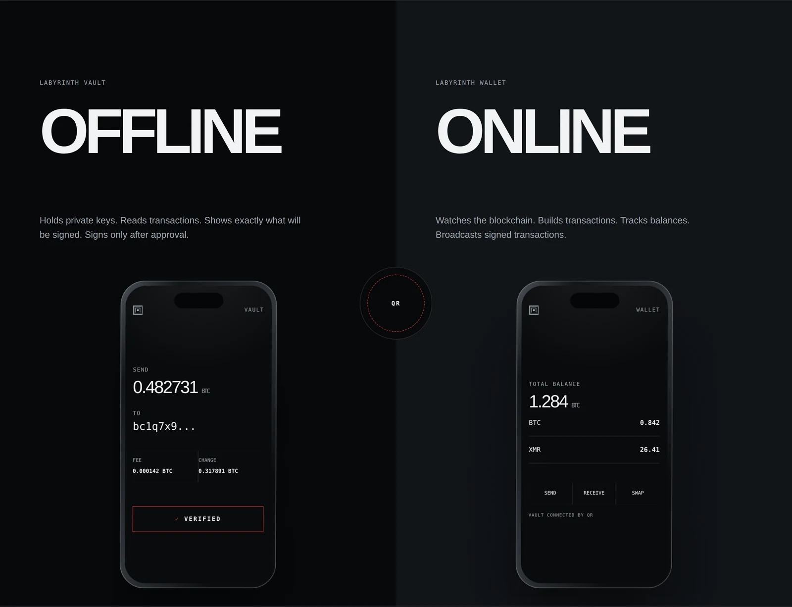

# Labyrinth

**Two apps that make an airgapped Bitcoin and Monero wallet out of a phone you
already own, and a spare one from a drawer.**



> ### Do not put money on this yet
>
> Nothing here has been independently audited.
>
> The vault's engine is tested, the app is wired to it, and as of this commit
> the whole iOS target compiles in Xcode. What that does not mean is that it
> has been *used*: it has never run against a real transaction on a real phone,
> and one measurement that decides part of its design is still missing.
>
> The wallet is a complete interface with no chain behind it. Every balance,
> price and fee it shows comes from a fixture, and it says so on screen for
> exactly as long as that stays true. It has never been compiled at all.
>
> Tested is not the same as safe to hold your savings.
>
> Read it, break it, tell us what is wrong with it. Do not trust it with a
> balance you would miss.

The old phone you stopped using is a computer with a screen, a camera, a
secure enclave and a battery. Take the SIM out, turn the radios off, install
the vault, and it becomes a hardware wallet that cost you nothing and that no
courier ever handled.

## The two apps

### Labyrinth Vault, the offline half


Runs on the phone with its radios off. It makes the keys, keeps them encrypted
at rest, reads a transaction handed to it as QR codes, renders it in full, and
signs only what a person approved.

It is not a wallet in the usual sense: it has no balance, no history and no
address book, because it never sees a chain. **It has no networking code in it
at all**, so there is nothing to misconfigure and nothing to leak. The only
thing that ever leaves is a QR code you point a camera at.

Native Swift and SwiftUI around one compiled TypeScript engine, evaluated on
device in JavaScriptCore. Source in [`ios/`](ios) and [`src/`](src).

<br clear="right">

### Labyrinth Wallet, the online half


Runs on the phone you actually carry. It watches Bitcoin and Monero with
public keys only, builds unsigned payments, shows them to the vault as animated
QR frames, reads the signed result back through the camera, checks it against
what was approved, and broadcasts.

**It has never seen a private key and has no screen that would accept one.**
What it can lose is your privacy, not your coins, which is why it ships with no
default node and explains why on the screen where you choose one.

React Native and Expo, importing the wire format and address rules from
[`src/`](src) rather than copying them. Source in [`wallet/`](wallet).

<br clear="right">

### And, because the wallet has to talk to strangers

[`worker/`](worker) is a Cloudflare Worker that stands between the wallet and
the exchanges and public chain nodes, so they see it instead of your phone. It
keeps nothing, and that is enforced by a test walking its own source rather
than promised. [`site/`](site) is the marketing site at
[labyrinthwallet.com](https://labyrinthwallet.com).

> **About the pictures above.** They are the marketing site's recreations of
> the two interfaces, built in HTML and CSS in [`site/`](site), not screenshots
> of the built apps. Real ones need a Mac and a device: the shot list is in
> [docs/shipping.md](docs/shipping.md), where they are also what App Store
> Connect wants. They are drawn from the same design system the apps use, so
> they are accurate about the layout and the words; they are not evidence that
> anything runs.

## How it works

Two halves that never touch. They talk in one direction at a time, by showing
each other QR codes.

```
   vault (offline)                        wallet (online)
   ───────────────                        ───────────────
   make keys
   show watch-only key   ──── QR ───▶     watch the chain
                                          build a payment
   read unsigned tx      ◀─── QR ────     show unsigned tx
   SHOW IT TO A PERSON
   sign, if approved
   show signed tx        ──── QR ───▶     broadcast
```

## The part that is actually the security

The vault renders every transaction in full and makes you approve it: amounts,
destinations, change, fee. That screen is the security boundary.

It has to be, because the alternative does not work. The online half might be
compromised, and if it is, it can hand the vault a transaction where every
byte is valid and the money goes to someone else. No checksum catches that. No
encryption catches that. A person reading the destination catches that.

Any build of this app that hides those details behind a friendly "Sign" button
has thrown away the only defense it had. The checksum on the wire is there to
catch a misread camera frame, and that is all it claims.

There is one thing the vault can do beyond showing you, and it does it: it
refuses outright in the cases where the screen would necessarily be lying. An
output that says it is your change but pays somebody else, or a transaction
that hides what its fee is, does not get a warning to scroll past. It does not
get signed. See `src/keys/psbt.ts`, which is the shortest honest description of
the threat model in the repository.

See [NOTICE.md](NOTICE.md) for the word lists and test vectors copied from other
projects, and why they are copied rather than imported.

See [docs/airgap-protocol.md](docs/airgap-protocol.md) for the wire format, the
fail-closed rules, and what the threat model does and does not cover.

## Where it is

Early. What exists and is tested:

- **The airgap wire** (`src/airgap/envelope.ts`). Chunking a payload across
  many QR frames, reading them back out of order and repeated, and refusing to
  assemble anything that does not match its own digest. 18 tests, most of them
  about the refusing.

- **BC-UR** (`src/airgap/ur.ts`). The format Sparrow, Keystone, Passport,
  BlueWallet and Cupcake already animate. Bytewords, a CBOR subset, and the
  fountain code that lets a scan finish even when the camera missed a frame.

- **base43 and BBQr** (`src/airgap/base43.ts`, `src/airgap/bbqr.ts`). The two
  other formats, because BC-UR is not universal and the wallets that skip it
  are not obscure ones: Electrum reads only base43, in one static code, and
  Coldcard reads only BBQr. `docs/wallet-compatibility.md` is the matrix, read
  out of each wallet's source.

  Interop cannot be tested by round-tripping our own encoder through our own
  decoder, because a wrong word table or a swapped pair of random draws passes
  that happily and is silently unreadable by everybody else. So the fixtures
  are generated by the reference implementation and the tests assert on its
  exact output: the same frame strings, character for character, and the same
  fragment choices for the same frame numbers.

- **A scanner** (`src/airgap/scanner.ts`) that reads either wire off one camera
  loop without being told which, and keeps both going, so pointing it at a
  different wallet mid-scan is not a restart.

- **The keys** (`src/keys/`). Monero seed phrases, addresses and view keys;
  Bitcoin BIP84 derivation, addresses and watch-only export.

  These two artifacts are the ones a person actually holds, and both are now
  checked against the encoders that have to read them rather than against this
  repository's own decoders. Every Monero address, subaddress, integrated
  address and twenty-five-word phrase is compared against Monero's own
  `get_account_address_as_str`, `get_subaddress` and
  `ElectrumWords::bytes_to_words`, on all three networks; the Bitcoin side is
  held to BIP84's published vector. That distinction is not pedantry: a wrong
  address is money nobody can spend, a phrase that restores in no other wallet
  is not a backup, and both failures look perfectly fine from inside.

  What did change is where secrets live. Anything secret is a `Uint8Array`,
  because a JavaScript string cannot be overwritten. Every copy the engine made
  survives until the collector moves it, and `wipe()` has nothing to write
  over. Turning a secret into text is unavoidable sometimes (a phrase has to be
  readable to be written down) but it is a one-way door, so it happens only
  through `revealMnemonic`, `revealSecretHex` and `revealWallet`. A test fails
  if that list grows.

- **Monero's spending primitives** (`src/keys/monerocrypto.ts`). The six
  operations every Monero transaction rests on: the Diffie-Hellman step that
  finds your own outputs, the one-time key it derives, and the key image that
  stops a double spend. Checked against 720 vectors taken verbatim from the
  Monero project's own `tests/crypto/tests.txt`.

  Five of the six are compositions of audited primitives. The sixth,
  `ge_fromfe_frombytes_vartime`, has no audited implementation anywhere. It is
  an Elligator-style map that exists only in Monero's `crypto-ops.c`, so it is
  transcribed by hand here, and that is exactly why its 120 vectors are tested
  in isolation, with no hashing before and no cofactor multiplication after.

  `src/keys/monerotx.ts` recognizes all six of wallet2's file formats by name,
  because telling somebody their perfectly good `unsigned_monero_tx` "is not a
  transaction" sends them off to debug a file that was never wrong. One of the
  six opens: an `unsigned_monero_tx` is decrypted and read
  (`src/keys/monerounsigned.ts`) and shown on a read-only screen. None of the
  six is signed, and that one is a decision rather than a gap: the file is the
  sending wallet's account of its own transaction, so a signature over it would
  be a signature over nobody's word but theirs. See
  [docs/monero-signing.md](docs/monero-signing.md) for what is left and why
  none of it is being guessed at.

- **The confirmation screen's contents** (`src/keys/psbt.ts`). The part that
  is actually the security. It reads an unsigned transaction and says what it
  does, then signs it or refuses.

  Three things it refuses over, each with tests that build the hostile
  transaction rather than describing it:

  - an output that claims to be your change but pays somebody else. Whether an
    output is yours is re-derived from your own key, never read from the file;
  - a transaction that will not say what its inputs are worth, because then the
    fee is unknowable and there is no honest way to display it;
  - bytes that are not the bytes that were approved. `signPsbt` takes the
    summary that was shown to a person and checks its digest, so a UI that
    describes one transaction and signs another fails instead of signing.

- **No network code, as a test** (`test/no-network.test.ts`). The claim at the
  top of this README is checked against the actual source on every run rather
  than trusted to stay true.

- **The sealed vault** (`src/keys/seal.ts`). What the seed looks like at
  rest: Argon2id (memory-hard, calibrated on the device itself) into
  XChaCha20-Poly1305, with the KDF parameters authenticated alongside the
  ciphertext so a file cannot be talked into weakening itself. Both primitives
  are pinned in the tests to implementations that share no code with ours:
  the Argon2 reference implementation and libsodium. The format is specified
  in [docs/storage-format.md](docs/storage-format.md).

- **A fuzzer** (`test/fuzz.test.ts`) that feeds every parser mangled frames,
  mixed payloads and raw noise, asserting two properties: nothing ever
  throws, and anything that assembles is byte-identical to something that was
  really encoded. It found a genuine subtlety of BC-UR's frame syntax on its
  first run, which is documented where it was found.

- **A supply chain that is part of the test suite**
  (`test/supply-chain.test.ts`). Every dependency exact-pinned, every package
  integrity-hashed, and the whole transitive closure walked and required to
  stay inside the audited noble/scure family. An upgrade is a visible diff,
  never a side effect.

- **One launch gate** (`src/selftest.ts`). Every module that can lose money
  proves itself against outside vectors on the device, at every launch, and
  the rule is that nothing runs if anything fails. See
  [SECURITY.md](SECURITY.md) for the threat model in one table.

- **The passphrase is bytes, not text** (`src/keys/seal.ts`,
  `ios/.../Passphrase.swift`). Everything secret in this project is a
  `Uint8Array`, because a string cannot be overwritten. The passphrase used to be
  the exception, which is the worst possible thing to make an exception of. It was crossing into the engine as text, so the one secret a person
  actually types existed unwipeable in two heaps at once.

  It now becomes NFKD bytes at the keyboard, crosses as bytes, and is zeroed on
  every path including the throwing one. The bridge *refuses* a string rather
  than encoding one, so the convenient path cannot quietly become the
  unwipeable path again.

  That normalization is the one behavior in this repository deliberately
  implemented twice, in Swift and in TypeScript, because the text has to stop
  being text before it crosses. It is allowed to be twice because
  `test/fixtures/primitives.json` pins the exact bytes for the inputs where two
  platforms could disagree, meaning ligatures, half-width characters and two
  spellings of e-acute, and both sides are checked against the file rather than
  against each other. Get it wrong and nothing fails loudly: you get a vault that opens on
  the phone that sealed it and on no other device.

- **A compiler over the Swift that matters** (`Package.swift`,
  `scripts/swift-check.sh`). Everything on this side used to be checked by
  regular expressions, meaning greps for a case in an enum or a name in a
  signature, because nothing in the repository could compile Swift. That is not the same
  thing, and the gap was not hypothetical: `Refusal.detail`, the switch that
  produces the words on every refusal screen, was missing five of its nine
  cases and would not have built.

  So the parts that can be reached without Xcode are reached. The transaction
  shapes, the refusal model and the passphrase encoding import Foundation and
  nothing else, deliberately, because those are the parts where a mistake is a
  wrong number on a confirmation screen, and they build as a SwiftPM target
  with 12 tests that run in the same `npm test` as everything else. Two of
  them decode JSON the TypeScript actually produced, from a real PSBT through
  the real reader, rather than comparing two descriptions of a shape.

  Both guards are kept, and each catches what the other cannot: renaming a
  field in Swift fails the decode as well as the regex, while a field Swift
  silently drops decodes perfectly and is caught only by the list comparison. That is
  checked rather than assumed.

- **The engine is verified before it runs** (`scripts/build-bundle.mjs`,
  `ios/.../Engine.swift`). The app is a signed binary plus half a megabyte of
  *data* that it then evaluates as code. Code signing covers that resource at
  install and nothing revisits it, so the app revisits it: the build writes the
  bundle's SHA-256 into a Swift constant, and the engine hashes what it loaded
  and refuses to evaluate anything that does not match. The digest lives in the
  signed text segment and the bundle does not, which is the asymmetry that
  makes the check worth making.

- **The engine** (`src/bridge/host.ts`, `ios/.../Engine.swift`). The app does
  not reimplement any of the above. The TypeScript is compiled to one file and
  run on the device in JavaScriptCore, so there is exactly one implementation
  of what a transaction says and it is the one under test. The bundle is
  rebuilt and driven end to end by `test/bundle.test.ts`: make a vault, unlock,
  export, read a transaction, sign, lock. See [docs/engine.md](docs/engine.md).

- **The online half** (`wallet/`). Labyrinth Wallet, the everyday app that
  watches the chain, builds the payments, shows them to the vault as QR frames
  and broadcasts what comes back. A React Native application with 513 tests of
  its own, and the whole interface exists: home, receive, the send flow end to
  end through the QR handoff, the vault screen, the swap, the node picker, the
  security center, and the state that matters most, which is a returned
  transaction that does not match the one that was approved.

  It imports the wire and the address rules from `src/` rather than copying
  them, so both halves speak one format by construction. It has its own
  package, because it depends on React Native and the vault's dependency list
  is a test.

  Three things about it are worth knowing before reading the code:

  - **There is no default node, deliberately.** A public Esplora server asked
    about your addresses learns your whole wallet from one IP, so choosing one
    is a decision the app makes you make, and running your own is presented as
    the ordinary choice rather than the advanced one. Nothing is sent anywhere
    until you have set one.
  - **The numbers are fixtures until you do.** `src/core/demo.ts` supplies every
    balance, price, fee estimate and confirmation count, and every screen
    showing one is marked `DEMO DATA` for exactly as long as that is true.
  - **The stand-in signer is compiled out of release.** A demo vault that signs
    with a published seed is the exact failure this product exists to prevent,
    so both it and the controls that reach it are behind `__DEV__`, and a test
    holds the store listing's "compiled out" claim to the code.

  See [wallet/README.md](wallet/README.md).

- **Swapping** (`wallet/src/core/swap.ts`), which is the one feature in this
  product the vault cannot fully cover, and is built around admitting that.

  A swap has three addresses. The deposit address belongs to the exchange, and
  the vault does see it: it is the recipient of an ordinary send, rendered in
  full and approved by a person. The refund and payout addresses go to the
  exchange over the network and appear in no transaction, so nothing signs them
  and no confirmation screen shows them. A compromised build could quote
  honestly, show the real deposit address, let the vault render it, and hand
  the exchange its own payout address. The money would go exactly where the
  screen said, the swap would complete, and the proceeds would land somewhere
  else.

  So the payout address is derived from the account key rather than typed, and
  there is no field on the screen to type one into. The order that comes back
  is compared against the request, and a refusal returns no order, which means
  no deposit address, which means nothing on the screen to send coins to. Once
  an order is verified the deposit goes through the ordinary send flow and the
  vault, because that part *is* checkable and must not be routed around.

- **The vault builds** (`ios/project.yml`). Twenty-three files that imported
  SwiftUI, JavaScriptCore, CryptoKit or CoreImage had only ever been *parsed*,
  because those frameworks exist nowhere but Apple's platforms. They compiled
  in Xcode on the first attempt.

  A compiler proves the app is well formed and nothing more. The launch gate
  evaluates the engine bundle, checks its digest and runs the self-test
  vectors, and none of that happens until it is on a device.

Next, in order:

1. **Run it on a real phone.** It compiles; it has not been used. Two things
   need a device rather than a simulator: the keychain's passcode-bound access
   class, which is the mechanism behind the screen that tells somebody their
   vault was deleted because they turned their passcode off, and one
   measurement. Whether the key derivation needs to be native rests on a single
   number nobody should guess: `npm run bench:kdf` says 1554 ms for the default
   parameters on a server CPU *with* a JIT, and JavaScriptCore inside an app
   has no JIT. See [docs/native-primitives.md](docs/native-primitives.md),
   which is also the argument for what should and should not ever be ported to
   Swift.
2. **Compile the wallet.** `expo prebuild` has been proven on Linux with
   `--no-install`, so the generated project is a known quantity, but nothing
   has run CocoaPods or a compiler over it. The vault's first build was clean;
   that is weak evidence about a different app in a different language.
3. **A node client for the wallet**, so the numbers stop being fixtures. Until
   then every screen showing a balance says `DEMO DATA`, and external
   TestFlight is gated on this rather than on the calendar.
4. **Monero signing, proved against something that is not us.** The primitives,
   CLSAG, Bulletproofs+, the transaction assembly and the confirmation screen
   are built and pinned to Monero's own vectors and to bytes Monero's own code
   produced. What has not happened is the differential test that matters:
   generating a set with a real Monero wallet, signing it on this device, and
   having a daemon accept the result. Until that has run on testnet and then
   stagenet, this is code that agrees with a fixture rather than with the
   network. [docs/monero-signing.md](docs/monero-signing.md) has the order of
   work and the two claims this repository has already had to correct.

## Marketing site

The cinematic product site lives in [`site/`](site). It is a standalone Vite +
React application with a scroll-controlled product film, dedicated mobile
media, and the complete Labyrinth Wallet/Vault security story.

```sh
cd site
npm install
npm run dev
```

The site is [labyrinthwallet.com](https://labyrinthwallet.com), served by Cloudflare
Pages from `site/` on `main`. [site/README.md](site/README.md) has the build
settings, and the one that catches people is the root directory.

## Shipping

[docs/shipping.md](docs/shipping.md) is the TestFlight runbook: what is done,
what needs a Mac, and the export compliance question written out with its
answer rather than left as a checkbox. The two apps answer that one
differently, and the difference is correct.

The App Store listing lives in [store/](store), one file per field, so the
words are version controlled next to the code they describe and a review
rejection is answered by editing a file.

```sh
npm run ship            # where both apps are
npm run ship -- --bump  # raise both build numbers together
```

## The repository

| | What | Runs where | Its own README |
| --- | --- | --- | --- |
| [`src/`](src) | The engine: keys, wire, transaction reading, sealing. TypeScript, compiled to one file the vault evaluates. | both apps | [docs/engine.md](docs/engine.md) |
| [`ios/`](ios) | Labyrinth Vault. Swift and SwiftUI around the engine. | offline phone | [ios/README.md](ios/README.md) |
| [`wallet/`](wallet) | Labyrinth Wallet. React Native and Expo. | everyday phone | [wallet/README.md](wallet/README.md) |
| [`worker/`](worker) | The relay in front of exchanges and chain nodes. Keeps nothing. | Cloudflare | [worker/README.md](worker/README.md) |
| [`site/`](site) | labyrinthwallet.com. Vite and React. | Cloudflare | [site/README.md](site/README.md) |
| [`store/`](store) | Every App Store listing field, one file each, version controlled beside the code they describe. | App Store Connect | [store/README.md](store/README.md) |
| [`test/`](test) | The guards. Most of them hold a sentence somewhere against what the code actually does. | `npm test` | |
| [`docs/`](docs) | The formats, the threat model, the runbooks. | | |

## Running the tests

```sh
npm install
npm test              # the engine, the guards, the Swift model, the listings
npm run typecheck
```

`npm test` is the whole pipeline rather than a test runner: it rebuilds the
engine bundle and writes its digest, regenerates the icons from the app's own
geometry and the Swift fixtures, runs vitest, then compiles the platform-free
Swift and runs its tests. A build whose regenerated artifacts differ from what
was committed fails CI, because that means the repository is lying about what
ships.

It proves this repository still produces what upstream said, by reading
committed fixtures. It does not prove upstream still says it. That is a
separate, slower check:

```sh
./oracle/build.sh --check && node oracle/emit.mjs --check    # Monero
./oracle/btc.sh && node oracle/btc-emit.mjs --check          # Electrum, BBQr
```

which rebuilds every fixture from upstream's own source at a pinned commit.
[docs/verification.md](docs/verification.md) is the ledger of which claim rests
on whose software, what that has caught, and what still has no witness at all.

The wallet has its own package and its own suite:

```sh
cd wallet && npm ci && npx vitest run && npx tsc --noEmit
```

And the two things that need a Mac, once you have one:

```sh
cd ios && xcodegen generate
xcodebuild -project LabyrinthVault.xcodeproj -scheme LabyrinthVault \
  -destination 'generic/platform=iOS' \
  CODE_SIGNING_ALLOWED=NO CODE_SIGNING_REQUIRED=NO build   # type-check
xcodebuild test -project LabyrinthVault.xcodeproj -scheme LabyrinthVault \
  -destination 'platform=iOS Simulator,name=iPhone 17'     # ⌘U
```

[ios/README.md](ios/README.md) has the traps, and one of them is worth reading
before the first attempt: **the same Swift sources are built twice under two
different sets of conventions**, once by SwiftPM and once by Xcode, and every
place they differ is invisible until somebody sits at a Mac.

## Design rules

- **No network code.** Not "no network calls we know about": no networking
  layer in the vault target at all, so there is nothing to review. The
  TypeScript build loads no DOM library, so `fetch` does not typecheck, and a
  test walks the source on every run to keep it that way.
- **Nothing at rest that is not encrypted.** Keys live behind the device's own
  secure hardware and a passphrase, and the app has no cloud, no account and
  no backup service to lose.
- **Fail closed.** Every ambiguity on the wire ends in "scan it again" rather
  than in a signature.
- **Show the person what they are signing.** Always, in full, before anything
  is signed.
