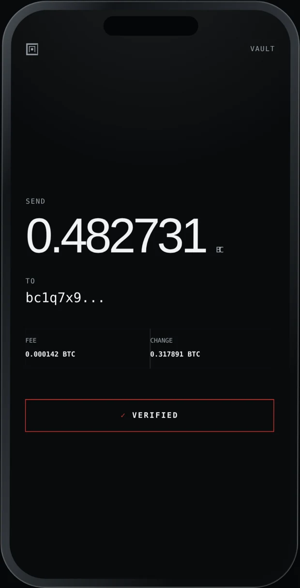

# Labyrinth Vault: the iOS shell



The native iPhone front end. The README at the repository root promises two
things next: the iOS shell, and the confirmation screen itself. This directory
is both.

The screen on the right is the product. Everything else in this directory
exists to get a transaction onto it accurately, and to make signing impossible
until somebody has read it. That image is the marketing site's recreation
rather than a screenshot: real ones need a device, and the shot list is in
[../docs/shipping.md](../docs/shipping.md).

<br clear="right">

It is SwiftUI, iOS 17, and it follows the same rules as the libraries it will
sit on top of:

- **No network code.** There is no `URLSession`, no `Network` framework, no
  socket anywhere in this target, and `test/ios-no-network.test.ts` walks the
  Swift source on every test run to keep it that way, the same treatment the
  TypeScript gets.
- **Fail closed.** The three refusal screens have exactly one action each,
  `SCAN AGAIN`. There is no "continue anyway" in the view code and no state in
  the model that could represent one.
- **What is displayed is what is signed.** The review screen hands the digest
  of the summary it displayed to the approval screen, mirroring the contract
  of `signPsbt` in `src/keys/psbt.ts`.

## Building

The project file is generated, not committed, so diffs stay readable. From the
repository root:

```sh
npm install
npm test                 # builds the engine bundle and the Swift fixtures
brew install xcodegen
cd ios && xcodegen generate && open LabyrinthVault.xcodeproj
```

`npm test` before `xcodegen` is not optional housekeeping. It regenerates
`Resources/vault.bundle.js`, writes its SHA-256 into `Support/BundleDigest.swift`,
and regenerates the fixtures the test target reads. Open the project without
it and the app will correctly refuse to launch, because the digest baked
into the binary will not match the bundle beside it.

Signing: `export LABYRINTH_TEAM_ID=ABCDE12345` and `project.yml` puts it into
every generated project. Do not set it in the Signing & Capabilities editor
instead. The `.xcodeproj` is regenerated and not committed, so that choice
disappears at the next `xcodegen generate`, and the build after it fails as
though signing had never been configured at all.

**To type-check, turn signing off rather than switching platform:**

```sh
xcodebuild -project LabyrinthVault.xcodeproj -scheme LabyrinthVault \
  -destination 'generic/platform=iOS' \
  CODE_SIGNING_ALLOWED=NO CODE_SIGNING_REQUIRED=NO build 2>&1 \
  | grep -E "error:" | sort -u
```

This compiles against the device SDK, which Xcode already has, and skips the
signing step that would otherwise stop the build. A device build resolves
signing **before the compiler runs**, so without those two flags a missing team
hides every compile error behind one line about a development team, which is
worth knowing precisely because it looks like good news: nothing was checked.

A simulator destination also needs no team and is the obvious-looking answer,
but since Xcode 26 the iOS runtime is not bundled, so `-destination
'generic/platform=iOS Simulator'` on a fresh install triggers a multi-gigabyte
runtime download before it compiles a line. Worth it when you want to *run* the
app. Not worth it to read a list of errors.

**To run the tests from the terminal you need a named device, not a generic
one.** `xcodebuild build` accepts `generic/platform=iOS Simulator`; `xcodebuild
test` does not, because it has to boot something. Ask what exists rather than
guessing a model name, which changes with every Xcode:

```sh
xcrun simctl list devices available
xcodebuild test -project LabyrinthVault.xcodeproj -scheme LabyrinthVault \
  -destination 'platform=iOS Simulator,name=iPhone 17'
```

**And `xcodegen generate` after every pull that touches `project.yml`.** The
`.xcodeproj` is a build artifact of that file and is not committed, so a pull
alone changes nothing Xcode can see. The symptom is a fix that appears not to
work, with the identical error as before.

There are no entitlements beyond camera access; the app asks for exactly one
permission, because the camera is the only wire it has.

## Two build systems, one set of sources

**Read this before adding a file under `LabyrinthVaultTests/`.** It is the only
part of this repository where a change can be green on every machine anybody
uses day to day and still be broken, and it cost four rounds of a Mac session
to learn once.

`Package.swift` and `ios/project.yml` compile overlapping sources under
different conventions. SwiftPM builds the platform-free half as a library and
runs its tests on any machine with a Swift toolchain, which is what
`npm run swift:check` and CI do. Xcode compiles the same files straight into
the app and runs the same tests against Apple's own frameworks, which is what
⌘U does.

Both are worth having and they are **not the same check**. SwiftPM is fast,
portable, and catches type errors. Xcode compiles the code as the app ships it,
against Apple's Foundation rather than swift-corelibs-foundation, which is the
entire point of `PassphraseContractTests`: NFKD is one Unicode annex with two
implementations, and only one of them is the one a real passphrase goes
through. That test passing on Linux is evidence. Passing on the device is the
thing that matters.

### Everywhere they disagree

Each of these was found the hard way, in this order, on the first Mac.

| | SwiftPM | Xcode | If you write only the SwiftPM form |
| --- | --- | --- | --- |
| Module name | `LabyrinthVaultCore`, a library target | `LabyrinthVault`, compiled into the app | ⌘U: *Unable to resolve module dependency* |
| Resource accessor | `Bundle.module`, synthesized | nothing synthesized | ⌘U: *Type 'Bundle' has no member 'module'* |
| Resource layout | `.copy` keeps `Fixtures/` | resource phase flattens to the bundle root | compiles, then finds no fixture at runtime |

The third is the dangerous one, because it fails later and looks like a broken
test rather than a wiring problem. `FixtureBundle.swift` tries both locations
for that reason.

### The rule, and what enforces it

**Anything a test reaches for that one build system provides and the other does
not goes behind a conditional, in one place, with both branches written at the
same time.** Not "make it work here and fix the other later": the other is a
Mac you may not be sitting at for a week, and the failure will arrive with no
memory of this attached to it.

`test/shipping.test.ts` holds all three, so the class is closed rather than the
instances:

- every file with `@testable import` uses the `canImport` conditional
- `Bundle.module` appears nowhere outside `FixtureBundle.swift`
- `ios/project.yml` sets no `PRODUCT_NAME`, which would rename the product out
  from under the test bundle's `TEST_HOST`

A fourth divergence will not be caught by those, because they name three
specific things. What generalizes is the symptom: **if `npm run swift:check`
passes and ⌘U does not, suspect a SwiftPM convenience before suspecting the
code.** Then add the conditional and a fourth guard here.

Adding the SwiftPM package to the Xcode project as a dependency is the obvious
way to collapse all of this into one convention, and it is worse. The app
target already compiles those files, so the package would build a second copy
of every type, and the tests would then be checking a copy that does not ship.

### What to expect on the first build

**It builds.** The first Xcode build of this target succeeded, which closes the
largest open question in the whole project: twenty-three files that had only
ever been parsed met a type-checker and survived it. What follows is kept as
written, because it explains what that does and does not prove.

**It had never been compiled by Xcode.** It was written on Linux, where
there is no Apple toolchain, so the first build was a code review the
compiler performed on our behalf rather than something that should
already have worked.

A compiler proves the app is *well formed*. It says nothing about whether it
*runs*: the launch gate evaluates the engine bundle in JavaScriptCore, checks
its SHA-256 against `Support/BundleDigest.swift`, and runs the self-test
vectors, and none of that happens until the app is on a device or a simulator.
A stale digest gives a build that compiles and then correctly refuses to launch,
which is why `npm test` comes before `xcodegen`.

What *has* been compiled, and is green, is the platform-free half: the
transaction shapes, the refusal model and the passphrase encoding, which
builds as a SwiftPM target and runs 12 tests on any machine with a Swift
toolchain (`npm run swift:check`, or `swift test` directly). That split is
deliberate: those files import Foundation and nothing else so that a compiler
can reach them. It is also how a genuine bug was found. `Refusal.detail` was
a non-exhaustive switch missing five of its nine cases, which no amount of
grepping would have shown.

Everything that imports SwiftUI, JavaScriptCore, CryptoKit or CoreImage had
only been *parsed*. Syntax, balanced braces, well-formed declarations. Not
types, not exhaustiveness, not whether a call exists. Real errors in
`Engine.swift`, `Vault.swift`, the screens and the design system were the
expected outcome, and none of them appeared. Two things bought that, and both
are worth keeping: the app's own contracts are checked by `test/app-wiring.test.ts`
walking the Swift source on every change, and the half that could be compiled
was compiled, which is where the one genuine bug turned up.

Note that `project.yml` pins `SWIFT_VERSION: "5.9"`. Under Swift 6's language
mode the three detached tasks in `Vault.swift` that carry an `Engine` and its
replies across actor boundaries would be errors rather than warnings. That
migration is real work and is not done; it is a deliberate not-yet, not an
oversight.

Two things worth running now that it builds:

1. **⌘U.** The test target runs `PassphraseContractTests`, which checks NFKD
   against `test/fixtures/primitives.json`, the same file the TypeScript is
   checked against. It passes on Linux, where NFKD comes from
   swift-corelibs-foundation. On a phone it comes from Apple's Foundation.
   Two implementations of one Unicode annex, and only one of them is the one
   a real passphrase will go through. This is the check that catches a vault
   that opens on the device that sealed it and nowhere else.

2. **Time one unseal on the oldest device you would ship to.** That single
   number decides whether the key derivation needs to be native, and nothing
   else can produce it. See [../docs/native-primitives.md](../docs/native-primitives.md).
   For reference, `npm run bench:kdf` reports about 1554 ms for the default
   parameters on a server CPU *with* a JIT, and JavaScriptCore inside a
   third-party app does not get one.

## What is real and what is staged

Real, in this code:

- The complete design system: color, type, spacing, the labyrinth geometry,
  the grain, the motion and haptic language.
- Every screen and every interaction: the scroll gate, hold-to-sign with
  progressive haptics, out-of-order frame acquisition, the refusal states,
  QR generation (CoreImage, offline) for the export and signed-transaction
  screens, and the AVFoundation scanner.
- The state machine: the signing route cannot be entered without a reviewed
  summary, and a refusal cannot be left except through the scanner.

Also real: the engine. `Engine.swift` loads the compiled TypeScript into
JavaScriptCore, verifies its SHA-256 against a constant written into the
binary at build time before evaluating a line of it, and every decision the
app makes, meaning what a transaction says and whether it can be signed, comes from
there rather than being reimplemented here.

Staged, and marked at the definition site:

- The demo fixtures in `Fixtures`, which feed the screens when there is no
  scanned transaction. The real path is wired: `Vault.offer(frame:)` goes to
  the engine and renders what it returns.
- The scanner falls back to a simulated frame stream in the Simulator, where
  there is no camera.

## Where the security actually is

Not here. The shell renders what the reader decodes and refuses when the
reader refuses. The one thing the interface itself is responsible for is the
thing no library can do: putting the destination, amount, fee and change in
front of a person, unabridged, and making the signature impossible until they
have moved all of it past their eyes. Every design decision in this directory
serves that screen.
