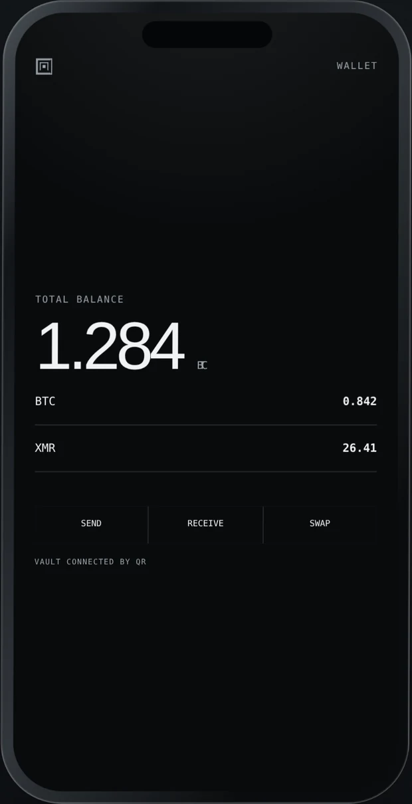

# Labyrinth Wallet



**The online half. A watch-only Bitcoin and Monero wallet that prepares
transactions, hands them to an airgapped vault as QR codes, and broadcasts what
comes back signed.**

The balances on the right are fixtures, and the running app says so on the
screen itself. The image is the marketing site's recreation rather than a
screenshot; this app has never been compiled, so there are no real ones yet.

<br clear="right">

> ### There is a chain behind it now, when you point it at one
>
> With no node set, every number comes from `src/core/demo.ts`, which is a
> fixture, and the app says `DEMO DATA` on the home screen for exactly as long
> as that is true. Set a node and the numbers are real: Bitcoin discovery,
> coins, history, fees and broadcast against any Esplora server
> (`src/core/discover.ts`, `src/core/watcher.ts`), and a Monero view-key scan
> that walks blocks on the device, proves every found amount against its
> on-chain commitment, and subtracts spends once the vault has answered a key
> image round trip (`src/core/moneroscan.ts`, `src/core/keyimages.ts`). There
> is deliberately no default node, and no price service is ever asked from the
> phone: dollar figures come from Labyrinth's own relay, which serves every
> client one cached answer (`worker/src/prices.ts`, `src/net/prices.ts`), and
> with no relay reachable balances are shown in coin.
>
> In a development build the send flow can also sign for itself with the seed
> phrase published in BIP84, the one every wallet's tests use, which controls
> nothing. It lives in `src/demo/standin.ts`, behind a control labeled
> `STAND-IN VAULT`, compiled out of release, and that file explains at length
> what keeps it from becoming the thing this whole product exists to prevent.
>
> A Monero spend signs and verifies end to end, and mainnet broadcast stays
> refused until a live stagenet acceptance is recorded
> (`src/core/moneroreadiness.ts`). Treat the whole thing as unaudited: do not
> put money on this yet.

## The two halves

Labyrinth is one wallet split across two devices that never touch.

```
   this app (online)                       the vault (offline)
   ─────────────────                       ───────────────────
   watch the chain
   build a payment
   show unsigned tx      ──── QR ───▶      read it
                                           SHOW IT TO A PERSON
                                           sign, if approved
   read signed tx        ◀─── QR ────      show signed tx
   CHECK IT MATCHES
   broadcast
```

The vault is the sibling of this directory: `..`, the rest of this repository.
It holds the keys, has no network code in it at all, and renders every
transaction in full before a person approves it. That confirmation screen is
the security boundary of the system. This app is everything else.

**What this app is allowed to know:** an extended public key, a Monero view
key, addresses, balances, unspent outputs, fee markets, prices, history.
Every one of those is public information. None of it can move a coin.

**What it can never have:** a private key. There is no screen that imports one,
no field that would accept one, and no type in `src/core/model.ts` with
anywhere to put one.

## Nodes

The wallet reads the chain through a node, and there is no node set by default.

That is deliberate and it costs convenience. Every other light wallet ships
pointing at a server the developer picked, which works the moment it is
installed and means one person decided, once, who gets to watch every user's
addresses forever. This app makes that choice in front of the person it affects,
on a screen that says what it costs before they make it.

**Bitcoin** goes through Esplora, which is `electrs` or Blockstream's server,
both of which run on an ordinary machine against your own bitcoind.
`src/net/esplora.ts` speaks it, `src/core/discover.ts` walks the account to
BIP44's gap limit of twenty, and `src/core/watcher.ts` turns the answers into
the same `ChainSnapshot` the fixture produced. The screens did not change.

What a public Bitcoin node learns is every address in the account, because a
light client has to ask about each one and they arrive in sequence from one IP.
That is inherent to light clients, not a flaw in this implementation, and the
nodes screen says it in those words. Running your own is the only fix and it is
presented as the ordinary option rather than the advanced one.

**Monero** is different, and better. A node serving blocks learns nothing about
which outputs are yours, because the scan happens on this device.
`src/net/monerod.ts` speaks the restricted RPC and `src/core/moneroscan.ts`
walks the chain from a birth height, testing every output with primitives
pinned to the Monero project's own vectors.

Amounts come out of RingCT commitments, and every one of them is proved against
the commitment the chain published before it is shown. An amount that does not
rebuild its commitment is reported as unknown rather than as a number, because
a wrong amount looks exactly like a right one on a screen.

The scan runs two hundred blocks per refresh, writes down where it got to, and
carries on from there next time. The percentage is on the nodes screen.

**Spends** take one trip across the room. A view key finds payments coming in
and cannot see them leave; that needs key images, and key images need the
spend key, which is in the vault. So the wallet shows the vault the outputs it
found (`XMROUTPUTS`), the vault proves each one is its own and answers with
the images (`XMRKEYIMAGES`), and from then on the chain walk spots spends for
free and the balance is received minus spent. Until that trip happens the
figure is what arrived, and the sentence under it says so.
[../docs/monero-sync.md](../docs/monero-sync.md) has the whole argument,
including what asking a node `is_key_image_spent` costs and why `rct::H` is
not derived the way you would guess.

## Swapping, and the address nothing can check

`src/core/swap.ts` trades one coin for another through a keyless exchange, and
it is the only feature in this product that the vault cannot fully cover.

A swap is three addresses. The **deposit** address belongs to the exchange and
the vault does see it: it is the recipient of an ordinary send, rendered in
full, approved by a person. The **refund** address and the **payout** address
are handed to the exchange over the network, and they are in no transaction at
all. Nothing signs them and no confirmation screen shows them.

So picture a compromised build of this app. It quotes honestly, it shows the
real deposit address, the vault renders it, you read it, you approve it, and
the money goes exactly where the screen said. The payout address that went to
the exchange was the attacker's. The swap completes, your coins arrive in
somebody else's wallet, and every screen along the way was telling the truth.

Two things are done about it.

**The payout address is derived, never accepted.** When the coin coming back is
one this wallet watches, the address comes from the account key the vault
handed over, and the screen has no field to type one into. A field is somewhere
to paste an attacker's address, and there is nothing here to paste.

**The order is checked against the request.** `verifyOrder` compares what the
exchange sent back against what it was given, and a refusal returns no order at
all. A `SwapOrder` is the only thing that carries a deposit address, so after a
refusal there is nothing on the screen to send coins to. That is the same shape
as `verifySigned`, for the same reason: a guarantee made of structure rather
than of a warning somebody can scroll past.

Swapping into a coin this wallet does not hold means typing an address neither
device can verify. That is allowed and it is labeled, in the same tone the rest
of the app uses for something it cannot promise.

Once an order exists, the deposit is an ordinary payment. Same compose, same
`prepare`, same vault, same confirmation screen. A swap does not get a private
road to a signature, because the deposit address is the one part of a swap the
vault *can* check and it must not be routed around.

The last thing, and it is on the screen every time rather than once: a swap
tells an exchange your IP address, the coin you are sending, and two addresses
you own. It is the least private thing this wallet can do.

The provider adapters come from the sibling project, where these request shapes
have run against the live APIs. Only the keyless providers came across. This
app has no server to keep an API key on, and a key compiled into a phone app is
a published key.

## Why the check on the way back is the interesting part

The obvious reading of the architecture is that the vault is the careful half
and this one is a display. The missing half of that thought: after the vault
signs, the signed bytes come back through a camera into an app running on a
phone with a network and an app store on it. The thing that *broadcasts* is
this device.

So `verifySigned` in `src/core/build.ts` compares what came back against the
intent recorded before the vault ever saw it: the same coins, the same
recipient, the same amount, the same fee, no extra outputs. A mismatch is
terminal. Not a warning, not a confirmation dialog. The state machine in
`src/core/session.ts` has no transition out of `mismatch` into a state that can
broadcast, and `test/session.test.ts` throws every event in the vocabulary at it
to prove that. The screen has no "broadcast anyway" button because there is no
state for the button to lead to.

That does not defend against a hostile build of this app; nothing inside a
hostile app does. It defends against the ordinary way money goes missing: a
misread frame that assembled into a different valid transaction, two send flows
open at once, a stale signed set still in the scanner's buffer.

## Running it

```sh
npm install          # in this directory
npm ci               # once, in the parent, for the vault's own dependencies
npm start            # then press i, or scan the code with Expo Go
```

```sh
npm test             # 91 tests
npm run typecheck    # strict, exactOptionalPropertyTypes, noUncheckedIndexedAccess
```

The app is iOS-only by design: `app.json` lists one platform, and the layouts,
gestures, haptics and sheet presentations assume an iPhone.

## What is shared with the vault, and what is not

The wire and the address rules are **imported**, not copied:

| Imported from `../src` | Why it is not a copy |
|---|---|
| `airgap/envelope` | Two implementations of a frame format drift, and the drift is found with a hundred frames already animating |
| `airgap/ur` | BC-UR is what Sparrow, Electrum, Keystone and Cupcake read; one encoder, spoken by both halves |
| `airgap/scanner` | Reads both wires off one camera loop without being told which |
| `keys/bitcoin` | `checkBtcAddress`, and the BIP84 derivation this app's addresses come from |
| `keys/monero` | `parseAddress`, and the checksum rules behind it |

The alias is `@vault/*` in `tsconfig.json`, and `metro.config.js` watches the
folder above so the bundler follows it.

What is deliberately *not* shared is the dependency list. The vault ships six
audited cryptography packages and a test that walks the transitive closure to
keep it that way. This app imports React Native, which is several hundred
packages before a line of ours runs. That is not a flaw in the design. It is
the reason the keys are on the other device, and it is why the wallet lives in
its own package with its own `package.json` rather than under the vault's.

## The design

Written down in three files, each of which argues for its decisions rather than
listing them:

- `src/design/tokens.ts`. The palette, the type scale, the spacing and the
  motion vocabulary. Five colors that are not grays, in the whole application,
  so that a red can still mean something.
- `src/design/geometry.ts`. The labyrinth. A single unbroken path, entered at
  the top, turning inward. It draws a payment's progress, because a payment
  here is not one process at a knowable rate: it stops entirely while somebody
  reads a screen on another phone. `test/geometry.test.ts` holds it to that.
- `src/qr/QrCanvas.tsx`. The QR code, which is the most important surface in
  the product, because it *is* the wire. White on black, full-size modules, a
  four-module quiet zone, and every design decision in it subordinate to being
  readable by a seven-year-old camera in a dim room.

## Where it is

What exists: the whole interface. Onboarding, home, assets, receive, the send
flow end to end (compose, review, transmit, wait, receive, verify, broadcast),
activity, transaction detail with the two-device timeline, the vault screen,
pairing, the security center, and the error states, including the one that
matters, which is a returned transaction that does not match.

Also real: the watcher behind `Watcher` in `src/core/chain.ts`, for both
chains; pairing, which reads the vault's `ACCOUNT` export off the camera,
proves the first address derives and the view key belongs to its address, and
keeps the result in the device keychain; and the key image round trip above.
Node addresses and the scan height live in one readable JSON file, and there
are no keys in it, because the keys have a keychain.

**Monero sending** is built up to its honest frontier. The online half is
done and tested: decoy selection over the chain's output distribution
(`core/decoys.ts`, matched to wallet2's gamma), coin selection and fee and the
change-goes-home arithmetic that is the real money-loss surface
(`core/monerospend.ts`), and the orchestration that assembles an unsigned set
against a node (`core/moneroplan.ts`). The vault's CLSAG ring signature
(`@vault/keys/monerosign`) round-trips and survives every adversarial tamper.

What is not established anywhere without a live node is that a from-scratch
Bulletproof+ range proof is accepted by the network, so the wallet refuses to
broadcast a Monero spend with real value on mainnet until a stagenet
acceptance is recorded. The gate is `core/moneroreadiness.ts`, it is a source
constant rather than a flag, and [../docs/monero-send.md](../docs/monero-send.md)
carries the whole argument, including why a range proof verified only against
its own prover is exactly the unverifiable thing this repository refuses to
write blind.

See [SECURITY.md](../SECURITY.md) for the threat model of the system, and
[docs/airgap-protocol.md](../docs/airgap-protocol.md) for what crosses between
the halves and what that does and does not protect you from.
